[comment]: <> (#!/usr/bin/pandoc --filter pandoc-plant-uml)

<h2 style="text-align: right"> Fabián Meléndez Aguilar </h2>
<h2 style="text-align: right" > B34144 </h2> 

Proyecto Final
====

## Estructuras de datos

* `Banderas`: Variable tipo word. Contiene las siguientes banderas, empezando por la asignada al bit menos significativo:
    - `TCL_LISTA`: Se activa cuando se suelta una tecla. 
    - `TCL_LEIDA`: Se activa cuando se presiona una tecla. 
    - `ARRAY_OK`: Se activa cuando la secuencia de datos se ingresó correctamente. 
    - `PANT_FLAG`: Indica si las pantallas se deben refrescar en MODO_SELECT. 
    - `CALC_TICKS`: Se enciende una vez que el tubo supera el rociador. 
* `MAX_TCL`: Constante tipo byte que determina el tamaño máximo de Num_Array.
* `Tecla`: Variable tipo byte que que guarda temporalmente el valor presionado por una tecla.
* `Tecla_IN`: Variable tipo byte al cual se asigna el valor que debe ser guardado en Num_Array.
* `Cont_Reb`: Variable tipo byte. Contador para ignorar los rebotes mecánicos de los botones.
* `Cont_TCL`: Variable tipo byte. Se refiere a la cantidad de datos ingresados en Num_Array.
* `Patron`: Variable tipo byte. Se utiliza como índice de filas para barrer la matriz del teclado.
* `Num_Array`: Dirección del arreglo de bytes de salida. En este se guardan los valores digitados en el teclado.
* `BRILLO`: Variable tipo byte. Indica el brillo del display de 7 segmentos y el arreglo de LEDs.
* `POT`: Variable tipo byte.
* `TICK_EN`: Variable tipo word.
* `TICK_DIS`: Variable tipo word.
* `CONT_ROC`: Variable tipo byte.
* `VELOC`: Variable tipo byte. Indica la velocidad con la que viaja el tubo por la cinta transportadora (dado en $\frac{cm}{s}$). 
* `LONG`: Variable tipo byte. Indica la longitud del tubo (dado en $cm$). 
* `TICK_MED`: Variable tipo word. Cantidad de milisegundos desde que se detecta un tubo en el primer sensor. 
* `BIN1`: Variable tipo byte. Número sin signo. 
* `BIN2`: Variable tipo byte. Número sin signo.
* `BCD1`: Variable tipo byte. Número BCD de dos dígitos.
* `BCD2`: Variable tipo byte. Número BCD de dos dígitos.
* `BCD_L`: Variable tipo byte. Número BCD de dos dígitos. 
* `BCD_H`: Variable tipo byte. Número BCD de dos dígitos.
* `TEMP`: Variable tipo byte. 
* `LOW`: Variable tipo byte.
  
  De izquierda a derecha: 
* `DISP1`: Variable tipo byte. Representación del dígito mostrado en la pantalla de 7 segmentos.
* `DISP2`: Variable tipo byte. Representación del dígito mostrado en la pantalla de 7 segmentos. 
* `DISP3`: Variable tipo byte. Representación del dígito mostrado en la pantalla de 7 segmentos. 
* `DISP4`: Variable tipo byte. Representación del dígito mostrado en la pantalla de 7 segmentos. 
* `LEDS`: Variable tipo byte que contiene el estado de encendido/apagado de los LEDs.
* `CONT_DIG`: Variable tipo byte. Utilizado como indicador del elemento que se está multiplexando en la pantalla de 7 segmentos/LEDs. 
* `CONT_TICKS`: Variable tipo byte. 
* `DT`: Variable tipo byte. 
* `CONT_7SEG`: Variable tipo word. Este contador se utliza para convertir el valor a enviarse al display de 7 segmentos.
* `Cont_Delay`: Variable tipo byte. Contador utilizado en la interrupción del temporizador por salida por comparador en el canal 4, y se utiliza para mantener un proceso IDLE por cierta cantidad de tiempo. 
* `D2mS`: Constante tipo byte. Valor asignado a un tiempo de espera de 2 milisegundos. 
* `D260uS`: Constante tipo byte. Valor asignado a un tiempo de espera de 260 microsegundos.  
* `D60uS`: Constante tipo byte. Valor asignado a un tiempo de espera de 60 microsegundos.  
* `ADD_L1`: Constante tipo byte. Primer comando a enviarse cuando se quiere escribir a la memoria de la pantalla LCD. 
* `ADD_L2`: Constante tipo byte. Segundo comando a enviarse cuando se quiere escribir a la memoria de la pantalla LCD.
* `Teclas`: Dirección del arreglo de bytes que contiene la asignación de las teclas a los valores deseados.
* `SEGMENT`: Dirección del arreglo de bytes que contiene la asignación de numeros decimales a valores para la pantalla de 7 segmentos.
* `iniDsp`: Dirección del arreglo de bytes que contiene la secuencia de comandos para inicializar la pantalla LCD.
* `MSGMC_U,MSGMC_D`: Direcciones de los arreglo de caracteres que contienen los mensajes que se despliegan en el modo `CONFIG` en la pantalla LCD.
* `MSGS_U,MSGS_D`: Direcciones de los arreglo de caracteres que contienen los mensajes que se despliegan en el modo `STOP` en la pantalla LCD.
* `MSGMS_U,MSMS1_D,MSMS2_D`: Direcciones de los arreglo de caracteres que contienen los mensajes que se despliegan en el modo `SELECT` en la pantalla LCD.

## Inicialización de hardware

$$T_{RTI}=\frac{(N+1)\cdot2^{M+9}}{8x10^6}=1x10^{-3}s$$

$$M=4$$

(No se puede utilizar $M = 0$ ya que este valor deshabilita RTI. $2^{13}$ se acerca a 8K, entonces se facilitan los cálculos.) 

$$N=\frac{1X10^{-3} \cdot 8x10^6}{2^{13}} - 1 = 0.0234$$

$$N=0$$
$$T_{RTI}=\frac{(1)\cdot2^{13}}{8x10^6}=1.024x10^{-3}s$$

Entonces `RTICTL` = `$40`

Según los requisitos del programa, la inicialización del HW se debe hacer antes del programa principal, por lo que se encapsulará en una subrutina alojada en `$1F00`. Esta subrutina se llama desde el programa principal.

Para las interrupciones por `output compare` se escoge un valor para el pre-escalador de `8`. Cálculos posteriores se basan en este valor de `PRS`.

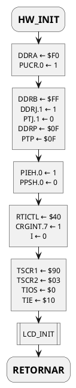
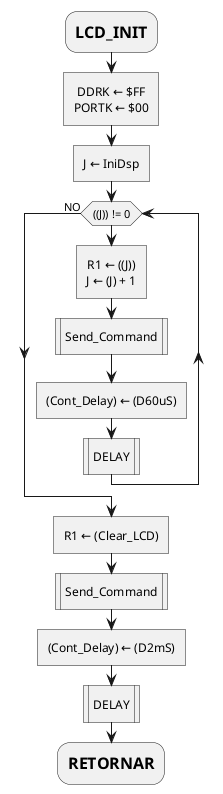

## Programa principal

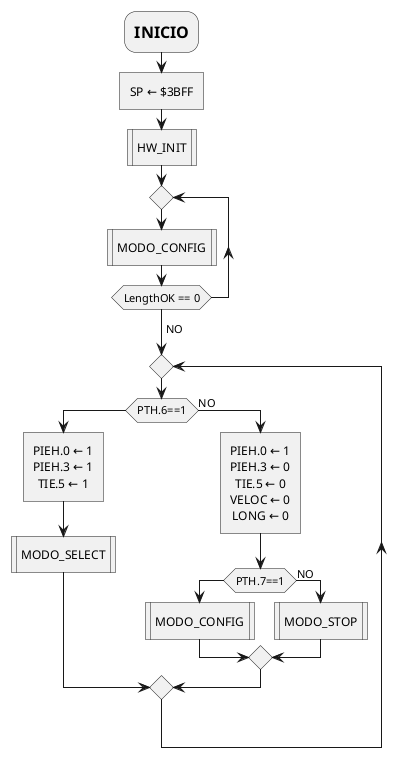

## MODO_CONFIG

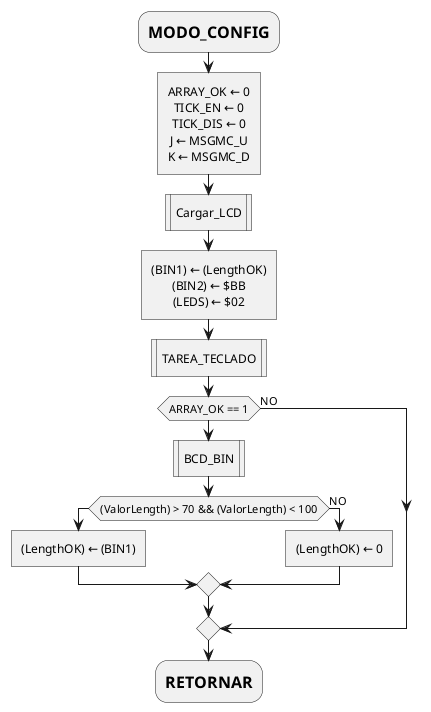

## MODO_STOP

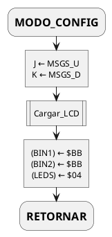

## MODO_SELECT

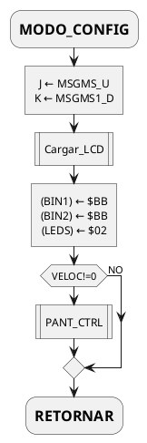

## BCD_BIN

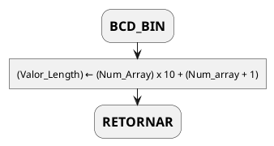

## RTI_ISR

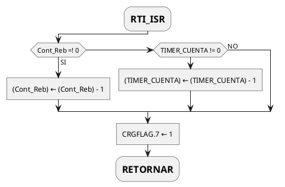


## OC4_ISR

$$TC4 = \frac{T_{interrupcion} \cdot BusClk }{PRS}$$
$$TC4 = \frac{20\mu s \cdot 24MHz}{2^3} = 60$$

Además, CONT_DIG se utliza como una máscara, y no como un contador, por eso se hacen desplazamientos lógicos.

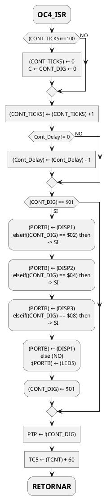

## CONV_BIN_BCD

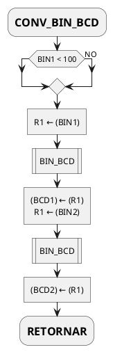

## BIN_BCD

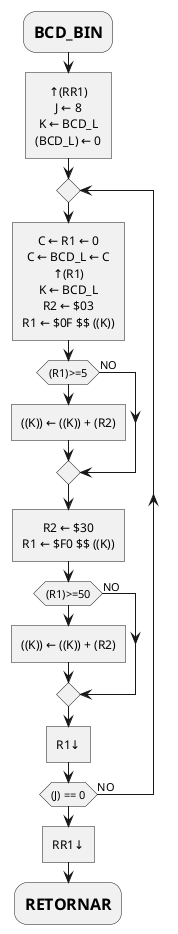

## BCD_7SEG

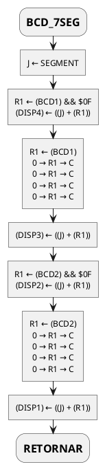

## Cargar_LCD

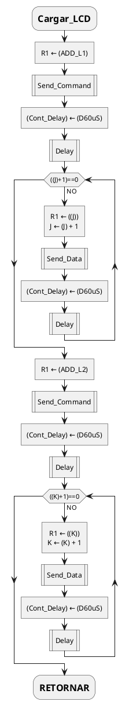

## DELAY

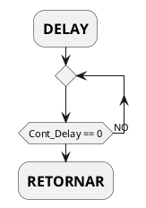

## Send_Command

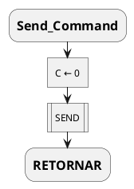

## Send_Data

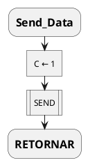

## SEND

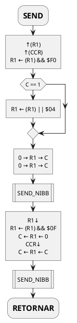


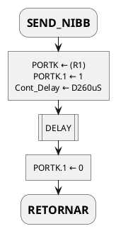

## TAREA_TECLADO

Se cambia el valor de contador de rebotes a 100 (ms), ya que con 10 aún no se suprimen todos los rebotes (al menos en esta tarjeta).

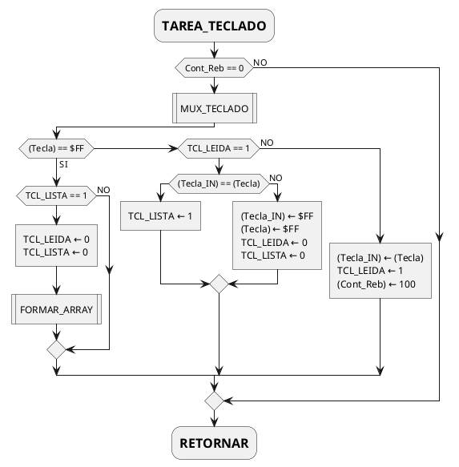
## MUX_TECLADO

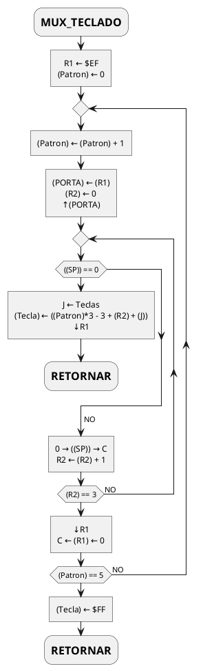
## FORMAR_ARRAY

```plantuml
@startuml
skinparam monochrome true
skinparam defaultTextAlignment center

:=FORMAR_ARRAY;
if((Tecla_IN) == $0E) then
  if(Cont_TCL != 0) then
    :(Cont_TCL) ← 0\nARRAY_OK ← 1] 
  endif
elseif((Tecla_IN) == $0B) then
  if(Cont_TCL != 0) then
    :J ← Num_Array\n(Cont_TCL) ← (Cont_TCL) - 1\n((J) + (Cont_TCL)) ← $FF]
  endif
else
  :J ← Num_Array\n((J) + (Cont_TCL)) ← (Tecla_IN)\n(Cont_TCL) ← (Cont_TCL) + 1]
endif
:=RETORNAR;
```

