[comment]: <> "#!/usr/bin/pandoc --filter pandoc-plant-uml"

<h2 style="text-align: right"> Fabián Meléndez Aguilar & Leonel Sánchez Lizano </h2>
<h2 style="text-align: right" > B34144 & B26213</h2> 

***Proyecto Final IE0623: RunMeter 623***
====

# Resumen

El proyecto a consiste en un programa para la tarjeta Dragon 12 diseñado para simular en el dispositivo un sistema para desplegar información de un  velódromo. El velódromo a simular cuenta con una pantalla de 7 segmentos de 4 dígitos una pantalla LCD y 2 sensores foto reflectivos (simulados con botones de la tarjeta). El sistema cuenta con 4 modos.

- MODO CONFIG: en este se puede configurar la cantidad de vueltas a procesar
- MODO LIBRE: permite tener el sistema en modo ocioso
- MODO COMPETENCIA: se miden la cantidad de vueltas hechas por el ciclista, y se despliega la informacion de vueltas y velocidad para que este las pueda visualizar.
- MODO RESUMEN: muestra al ciclista un resumen de su rendimiento al calcular la velocidad promedio en las vueltas realizadas 

Se logran satisfacer los requerimientos del programa, que en resumen son:
  * Cambio de modos de operación
  * Ingreso de parámetros de configuración por medio del teclado matricial
  * Retroalimentación de los procesos a través de las pantallas
  * Ajuste de brillo en el display de 7 segmentos utilizando el potenciómetro de la tarjeta de desarrollo
  * Temporización correcta de procesos
  * Cálculo de características físicas a partir de dichas temporizaciones

Se realizaron varios `unit tests` y `integration tests` haciendo uso del API en python para D-Bug12 ([https://github.com/mlndz28/d-bug12](https://github.com/mlndz28/d-bug12)).

# Diseño de la Aplicación


## Estructuras de datos

* `Banderas`: Variable tipo word. Contiene las siguientes banderas, empezando por la asignada al bit menos significativo:
    - `TCL_LISTA`: Se activa cuando se suelta una tecla. 
    - `TCL_LEIDA`: Se activa cuando se presiona una tecla. 
    - `ARRAY_OK`: Se activa cuando la secuencia de datos se ingresó correctamente. 
    - `PANT_FLAG`: Indica si las pantallas se deben refrescar en MODO_COMPETENCIA. 
    - `CALC_TICKS`: Se enciende una vez que el tubo supera el rociador. 
* `MAX_TCL`: Constante tipo byte que determina el tamaño máximo de Num_Array.
* `Tecla`: Variable tipo byte que que guarda temporalmente el valor presionado por una tecla.
* `Tecla_IN`: Variable tipo byte al cual se asigna el valor que debe ser guardado en Num_Array.
* `Cont_Reb`: Variable tipo byte. Contador para ignorar los rebotes mecánicos de los botones.
* `Cont_TCL`: Variable tipo byte. Se refiere a la cantidad de datos ingresados en Num_Array.
* `Patron`: Variable tipo byte. Se utiliza como índice de filas para barrer la matriz del teclado.
* `Num_Array`: Dirección del arreglo de bytes de salida. En este se guardan los valores digitados en el teclado.
* `BRILLO`: Variable tipo byte. Indica el brillo del display de 7 segmentos y el arreglo de LEDs.
* `POT`: Variable tipo byte. Indica la posición del trimmer.
* `TICK_EN`: Variable tipo word.
* `TICK_DIS`: Variable tipo word.
* `CONT_ROC`: Variable tipo byte.
* `VELOC`: Variable tipo byte. Indica la velocidad con la que viaja el ciclista (dado en $\frac{km}{h}$). 
* `TICK_MED`: Variable tipo word. Cantidad de milisegundos desde que se detecta un tubo en el primer sensor. 
* `BIN1`: Variable tipo byte. Número sin signo. 
* `BIN2`: Variable tipo byte. Número sin signo.
* `BCD1`: Variable tipo byte. Número BCD de dos dígitos.
* `BCD2`: Variable tipo byte. Número BCD de dos dígitos.
* `BCD_L`: Variable tipo byte. Número BCD de dos dígitos. 
* `BCD_H`: Variable tipo byte. Número BCD de dos dígitos.
* `TEMP`: Variable tipo byte. 
* `LOW`: Variable tipo byte.
  
  De izquierda a derecha: 
* `DISP1`: Variable tipo byte. Representación del dígito mostrado en la pantalla de 7 segmentos.
* `DISP2`: Variable tipo byte. Representación del dígito mostrado en la pantalla de 7 segmentos. 
* `DISP3`: Variable tipo byte. Representación del dígito mostrado en la pantalla de 7 segmentos. 
* `DISP4`: Variable tipo byte. Representación del dígito mostrado en la pantalla de 7 segmentos. 
* `LEDS`: Variable tipo byte que contiene el estado de encendido/apagado de los LEDs.
* `CONT_DIG`: Variable tipo byte. Utilizado como indicador del elemento que se está multiplexando en la pantalla de 7 segmentos/LEDs. 
* `CONT_TICKS`: Variable tipo byte. Debe incrementar en uno cada $20 \mu s$.
* `DT`: Variable tipo byte. Se utiliza para definir la duración de encendido en la sección de multiplexación de pantallas.
* `CONT_7SEG`: Variable tipo word. Este contador se utliza para convertir el valor a enviarse al display de 7 segmentos.
* `Cont_Delay`: Variable tipo byte. Contador utilizado en la interrupción del temporizador por salida por comparador en el canal 4, y se utiliza para mantener un proceso IDLE por cierta cantidad de tiempo. 
* `D2mS`: Constante tipo byte. Valor asignado a un tiempo de espera de 2 milisegundos. 
* `D260uS`: Constante tipo byte. Valor asignado a un tiempo de espera de 260 microsegundos.  
* `D60uS`: Constante tipo byte. Valor asignado a un tiempo de espera de 60 microsegundos.  
* `ADD_L1`: Constante tipo byte. Primer comando a enviarse cuando se quiere escribir a la memoria de la pantalla LCD. 
* `ADD_L2`: Constante tipo byte. Segundo comando a enviarse cuando se quiere escribir a la memoria de la pantalla LCD.
* `D5mS`: Constante tipo byte. Valor asignado a un tiempo de espera de 5 milisegundos. 
* `POSITION`: Variable tipo byte. Cache de la posicion anterior de la tarjeta. 
* `Teclas`: Dirección del arreglo de bytes que contiene la asignación de las teclas a los valores deseados.
* `SEGMENT`: Dirección del arreglo de bytes que contiene la asignación de numeros decimales a valores para la pantalla de 7 segmentos.
* `iniDsp`: Dirección del arreglo de bytes que contiene la secuencia de comandos para inicializar la pantalla LCD.
* `MSGMC_U,MSGMC_D`: Direcciones de los arreglo de caracteres que contienen los mensajes que se despliegan en el modo `CONFIG` en la pantalla LCD.
* `MSGS_U,MSGS_D`: Direcciones de los arreglo de caracteres que contienen los mensajes que se despliegan en el modo `STOP` en la pantalla LCD.
* `MSGMS_U,MSGMS1_D,MSGMS2_D,MSGMSNV_U,MSGMSNV_D,MSGMSV_U,MSGMSV_D,MSGMSA_U,MSGMS1A_D`: Direcciones de los arreglo de caracteres que contienen los mensajes que se despliegan en el modo `SELECT` en la pantalla LCD.

## Inicialización de hardware

$$T_{RTI}=\frac{(N+1)\cdot2^{M+9}}{8x10^6}=1x10^{-3}s$$

$$M=4$$

(No se puede utilizar $M = 0$ ya que este valor deshabilita RTI. $2^{13}$ se acerca a 8K, entonces se facilitan los cálculos.) 

$$N=\frac{1X10^{-3} \cdot 8x10^6}{2^{13}} - 1 = 0.0234$$

$$N=0$$
$$T_{RTI}=\frac{(1)\cdot2^{13}}{8x10^6}=1.024x10^{-3}s$$

Entonces `RTICTL` = `$40`

Según los requisitos del programa, la inicialización del HW se debe hacer antes del programa principal, por lo que se encapsulará en una subrutina alojada en `$1F00`. Esta subrutina se llama desde el programa principal.

Para las interrupciones por `output compare` se escoge un valor para el pre-escalador de `8`. Cálculos posteriores se basan en este valor de `PRS`.

Las interrupciones en el convertidor analógico-digital se manejan para el potenciómetro ubicado en el puerto 7 del módulo AD. Se configura para 2 periodos de reloj para el muestreo, una resolución de 8 bits sin signo y 5 conversiones. Se ajusta el valor de frecuencia de operación al valor más bajo posible (500 kHz) con:

$$PRS=\frac{BusClock}{2 \cdot ATDclock}-1 = \frac{24MHz}{2 \cdot 500 kHz}-1=23$$

Entonces: 
  * `ATD0CTL2` = `$C2`
  * `ATD0CTL3` = `$28`
  * `ATD0CTL4` = `$97`
  * `ATD0CTL5` = `$87`

```plantuml
@startuml
scale max 400 height
skinparam monochrome true
skinparam defaultTextAlignment center

:=HW_INIT;
:DDRA ← $F0
PUCR.0 ← 1]
:DDRB ← $FF
DDRJ.1 ← 1
PTJ.1 ← 0
DDRP ← $0F
PTP ← $0F]
:PIEH.0 ← 1
PPSH.0 ← 0]
:RTICTL ← $40
CRGINT.7 ← 1
I ← 0]
:TSCR1 ← $90
TSCR2 ← $03
TIOS ← $30
TIE ← $10]
:ATD0CTL2 ← $C2
(Cont_Delay) ← (D5ms)]
:DELAY|
:(Cont_Delay) ← (D5ms)]
:DELAY|
:ATD0CTL3 ← $28
:ATD0CTL4 ← $97]
:LCD_INIT|
:=RETORNAR;
@enduml
```

\pagebreak

La subrutina de inicialización de la pantalla LCD se define de la siguiente manera.

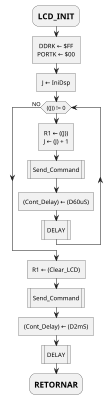

## Programa principal

Aquí se asegura que los valores de configuración son ingresados correctamente antes de poder cambiar de modo. Una vez que este requerimiento se satisface, se monitorea iterativamente el estado de los switches que manejan el modo de operación. Antes de entrar a cada modo se habilitan/deshabilitan las interrupciones correspondientes.

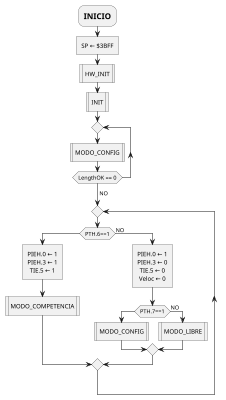

## MODO_CONFIG

Se carga el mensaje informativo en la pantalla LCD, el valor de LengthOK en el display de 7 segmentos y se enciende el LED correspondiente a este modo. Luego se revisa si alguna tecla ha sido presionada, mediante la subrutina `TAREA_TECLADO`. En caso de que la secuencia haya sido ingresada, una vez validada se guarda en `NumVueltas`. En caso de que no haya sido validada exitosamente, se borra el valor ingresado.

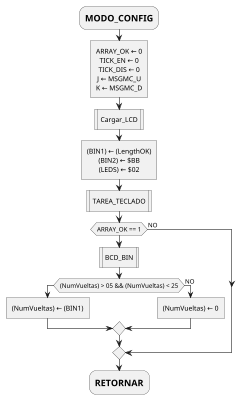

## MODO_LIBRE

En este modo no se hacen mediciones, sólo se muestra un mensaje informativo en la pantalla LCD y se enciende el LED de modo correspondiente.

```plantuml
@startuml
scale max 200 height
skinparam monochrome true
skinparam defaultTextAlignment center
:=MODO_STOP;
:J ← MSGS_U
K ← MSGS_D]
:Cargar_LCD|
:(BIN1) ← $BB
(BIN2) ← $BB
(LEDS) ← $04]
:=RETORNAR;

@enduml
```

## MODO_COMPETENCIA

En este modo se esperan las mediciones del puerto H, y una vez que se tienen los parámetros físicos, se validan y se calculan otras medidads compuestas. 

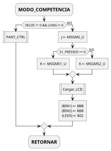

## PANT_CTRL

Se actualizan los mensajes en la pantalla según los cálculos obtenidos para la velocidad y la longitud del tubo.

La temporización de los mensajes en las pantallas, y del rociador se calculan de la siguiente manera.

* $T_{encender(pantalla)}= 0[ms]$, si la velocidad es incorrecta, ya que se busca cambiar el mensaje en la pantalla de inmediato, y $T_{apagar(pantalla)}= 3000 [ms]$ 
* $T_{encender(pantalla)}= \frac{255[m]}{Veloc} \cdot 1000$, de otra forma, para que se encienda 100 metros antes de la pantalla, y $T_{apagar(pantalla)}= \frac{355[m]}{Veloc} \cdot 1000$, que es cuando el ciclista terminó de pasar por el monitor. El `relay` se enciende por 200 ms.

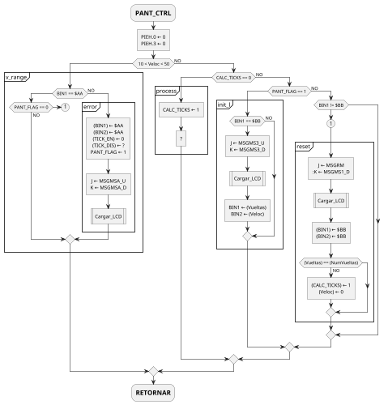

## BCD_BIN

Convierte dos dígitos BCD (en bytes separados) a un valor binario.

```plantuml
@startuml
scale max 100 height
skinparam monochrome true
skinparam defaultTextAlignment center
:=BCD_BIN;
:(NumVueltas) ← (Num_Array) x 10 + (Num_array + 1)]

:=RETORNAR;

@enduml
```

## RTI_ISR

Subrutina de interrupción para `RTI`. Se decrementan varios contadores. Cada 200ms se activa la interrupción de conversión analógica a digital. Maneja contadores que no necesitan gran precisión y controla el *key-bounce suppressor timer* 

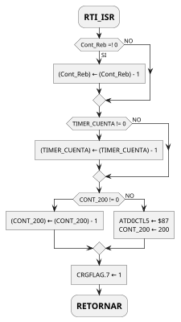

## OC4_ISR

Aca se maneja el refrescamiento de las pantallas multiplexadas, así como la temporización de los retardos en la subrutina `DELAY`.

Para llamar esta subrutina cada $20\mu s$, se configura de la siguiente forma:

$$TC4 = \frac{T_{interrupcion} \cdot BusClk }{PRS}$$
$$TC4 = \frac{20\mu s \cdot 24MHz}{2^3} = 60$$

Además, CONT_DIG se utliza como una máscara, y no como un contador, por eso se hacen desplazamientos lógicos.

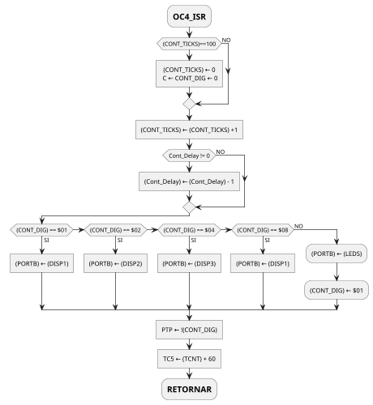

## ATD_ISR

Subrutina llamada cada 200 ms. Se encarga de la conversión analógica a digital de la señal del trimmer ubicada en AD7. Guarda en `POT` el valor del potenciometro con una resolución de 8 bits. Luego normaliza ese valor a 100 y lo guarda en `BRILLO`.

```plantuml
@startuml
skinparam monochrome true
skinparam defaultTextAlignment center
scale max 200 height

:=ATD_ISR;
:RR1 ← ADR00H
RR1 ← (RR1) + ADR01H
RR1 ← (RR1) + ADR02H
RR1 ← (RR1) + ADR03H
RR1 ← (RR1) + ADR04H
RR1 ← (RR1) / 5
POT ← (R2)
BRILLO ← (R2)*100/255]
:=RETORNAR;
@enduml
```

## CONV_BIN_BCD

Convierte dos numeros sin signo a su representación en BCD con dos dígitos cada uno.

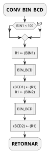

## BIN_BCD

Convierte un número BCD de dos dígitos a un valor binario mediante el algoritmo XS3.

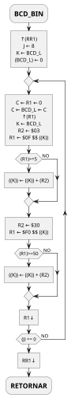

## BCD_7SEG

Carga en memoria los valores a enviar a la pantalla de 7 segmentos según dígitos guardados como BCD.

```plantuml
@startuml
scale max 400 height
skinparam monochrome true
skinparam defaultTextAlignment center
:=BCD_7SEG;
:J ← SEGMENT]
:R1 ← (BCD1) && $0F
(DISP4) ← ((J) + (R1))]
:R1 ← (BCD1)
0 → R1 → C
0 → R1 → C
0 → R1 → C
0 → R1 → C]
:(DISP3) ← ((J) + (R1))]
:R1 ← (BCD2) && $0F
(DISP2) ← ((J) + (R1))]
:R1 ← (BCD2)
0 → R1 → C
0 → R1 → C
0 → R1 → C
0 → R1 → C]
:(DISP1) ← ((J) + (R1))]
:=RETORNAR;
@enduml
```

## Cargar_LCD

Carga en la memoria de la pantalla LCD los valores de los caracteres a ser mostrados en el display. La secuencia de comandos y datos enviados es la siguiente:

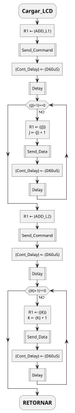

## DELAY

Espera a que el contador `Cont_Delay` llega a cero para salir de la subrutina. Cont_Delay se decrementa por una interrupción de timer cada 20 us.


## Send_Command

Envía un comando a la pantalla LCD a través del puerto K.

```plantuml
@startuml
scale max 150 height
skinparam monochrome true
skinparam defaultTextAlignment center

:=Send_Command;
:C ← 0]
:SEND|
:=RETORNAR;
@enduml
```

## Send_Data

Envía un byte de datos a la pantalla LCD a través del puerto K.

```plantuml
@startuml
scale max 150 height
skinparam monochrome true
skinparam defaultTextAlignment center

:=Send_Data;
:C ← 1]
:SEND|
:=RETORNAR;
@enduml
```

## SEND

Lógica común para `Send_Data` y `Send_Command`.


## TAREA_TECLADO

Maneja la supresión de rebotes en el teclado e implementar la lectura por flanco decreciente.

Se cambia el valor de contador de rebotes a 100 (ms), ya que con 10 aún no se suprimen todos los rebotes (al menos en esta tarjeta).

```plantuml
@startuml
scale max 400 height
skinparam monochrome true

:=TAREA_TECLADO;
if(Cont_Reb == 0) then
  :MUX_TECLADO|
  if((Tecla) == $FF) then (SI)
    if(TCL_LISTA == 1) then
      :TCL_LEIDA ← 0\nTCL_LISTA ← 0]
      :FORMAR_ARRAY|
    else (NO)
    endif
  elseif(TCL_LEIDA == 1) then
      if((Tecla_IN) == (Tecla)) then
        :TCL_LISTA ← 1]
      else (NO)
        :(Tecla_IN) ← $FF\n(Tecla) ← $FF\nTCL_LEIDA ← 0\nTCL_LISTA ← 0]
      endif
  else (NO)
    :(Tecla_IN) ← (Tecla)\nTCL_LEIDA ← 1\n(Cont_Reb) ← 100]
  endif
else(NO)
endif
:=RETORNAR;
@enduml
```

## MUX_TECLADO

Se encarga de leer los valores del «keypad» a través del puerto A y asociarlos a un valor contenido en `Teclas`.

```plantuml
@startuml
scale max 600 height
skinparam monochrome true
skinparam defaultTextAlignment center

:=MUX_TECLADO;
:R1 ← $EF\n(Patron) ← 0]
repeat
  :(Patron) ← (Patron) + 1]
  :(PORTA) ← (R1)\n(R2) ← 0\n↑(PORTA)]
  repeat
    if(((SP)) == 0) then
      :J ← Teclas\n(Tecla) ← ((Patron)*3 - 3 + (R2) + (J))\n↓R1]
      :=RETORNAR;
      detach
    endif
    -> NO;
    :0 → ((SP)) → C\nR2 ← (R2) + 1]
  repeat while((R2) == 3) is (NO)
  :↓R1\nC ← (R1) ← 0]
repeat while((Patron) == 5) is (NO)
:(Tecla) ← $FF]
:=RETORNAR;
@enduml
```

## FORMAR_ARRAY

Guarda los valores ingresados en el «keypad» a un array, e implementa la funcionalidad de las teclas `B` (borrar) y `E` (enter).

```plantuml
@startuml
scale max 300 height
skinparam monochrome true
skinparam defaultTextAlignment center

:=FORMAR_ARRAY;
if((Tecla_IN) == $0E) then
  if(Cont_TCL != 0) then
    :(Cont_TCL) ← 0\nARRAY_OK ← 1] 
  endif
elseif((Tecla_IN) == $0B) then
  if(Cont_TCL != 0) then
    :J ← Num_Array\n(Cont_TCL) ← (Cont_TCL) - 1\n((J) + (Cont_TCL)) ← $FF]
  endif
else
  :J ← Num_Array\n((J) + (Cont_TCL)) ← (Tecla_IN)\n(Cont_TCL) ← (Cont_TCL) + 1]
endif
:=RETORNAR;
@enduml
```

## Conclusiones, comentarios y recomendaciones

El trabajo, aunque rico en conceptos de arquitecturas de computadoras, es difícil en cuanto se entiende el funcionamiento específico de este modelo de microprocesador. Se recomienda hacer scripts que ayuden a la modularización del programa (`makefile` es una herramienta muy útil). La implementación de pruebas automatizadas, así como el uso de un CLI para el proceso de debugging es casi obligatorio para evitar el exceso de desgaste con las repeticiones mecánicas e innecesarias de las herramientas disponibles.

## Bibliografía

* Freescale. (2006). CPU 12 Reference Manual. Rev. 4.0. Arizona: Freescale Semiconductor.
* Freescale. (2005). ATD_10B8C Block User Guide. Rev. 2.11. Arizona: Freescale Semiconductor.
* Huang, H.W. (2009). The HCS12 / 9S12: An Introduction to Software and Hardware Interfacing.  Cengage Learning.
* Almy, T. (2009). Designing with Microcontrollers – The 68HCS12.